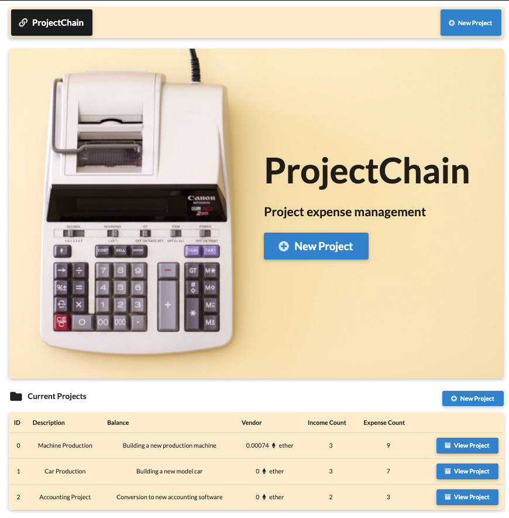
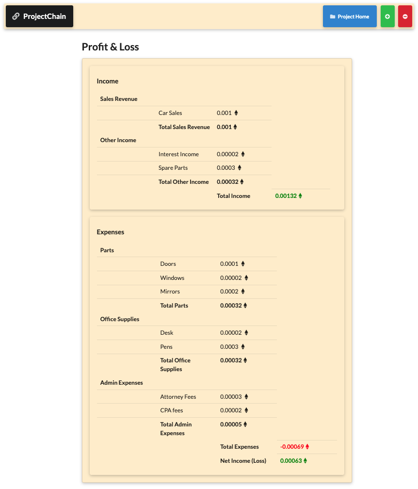

## ProjectChain Solidity Dapp

ProjectChain is a project expense management application powered by the Ethereum blockchain for accurate recording, payment, tracking, and management of project expenses.

With ProjectChain you can:

- Create new projects
- Input income and expenses
- Pay vendors for expenses with ether
- Receive payments on invoices with ether
- View project profitability via a profit and loss statement

> This project was built using Solidity, web3, React, Next.js, Semantic UI React, and the Rinkeby Testnet.

## Link

See project link below. The project can be used by creating a MetaMask account on the Rinkeby Testnet.

https://solidity-dapp.vercel.app/

## Screenshots

